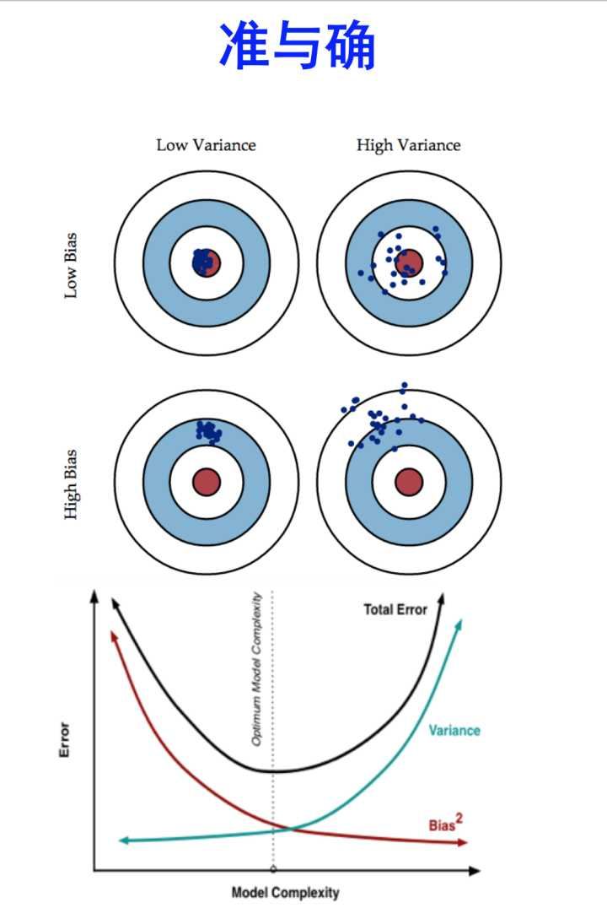

## **Regularization**

正则化可以解决过拟合。

Variance measures the consistency (or variability) of the model prediction for a particular sample instance if we would retrain the model multiple times, for example, on different subsets of the training dataset. We can say that the model is sensitive to the randomness in the training data. In contrast, bias measures how far off the predictions are from the correct values in general if we rebuild the model multiple times on different training datasets; bias is the measure of the systematic error that is not due to randomness.

